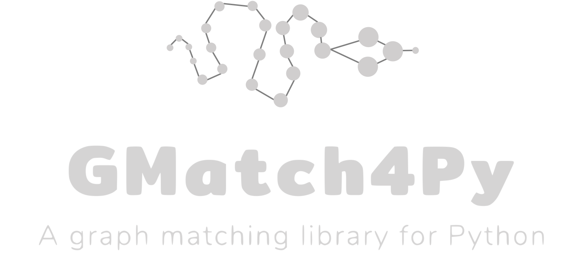

[](https://travis-ci.com/Jacobe2169/GMatch4py)
# GMatch4py a graph matching library for Python 


GMatch4py is a library dedicated to graph matching. Graph structure are stored in NetworkX graph objects.
GMatch4py algorithms were implemented with Cython to enhance performance.

## Requirements

 * Python 3
 * Numpy and Cython installed (if not : `(sudo) pip(3) install numpy cython`)
 
## Installation

To install `GMatch4py`, run the following commands:

```bash
git clone https://github.com/Jacobe2169/GMatch4py.git
cd GMatch4py
(sudo) pip(3) install .
```

## Get Started
### Graph input format

In `GMatch4py`, algorithms manipulate `networkx.Graph`, a complete graph model that 
comes with a large spectrum of parser to load your graph from various inputs : `*.graphml,*.gexf,..` (check [here](https://networkx.github.io/documentation/stable/reference/readwrite/index.html) to see all the format accepted)

### Use GMatch4py
If you want to use algorithms like *graph edit distances*, here is an example:

```python
# Gmatch4py use networkx graph 
import networkx as nx 
# import the GED using the munkres algorithm
import gmatch4py as gm
```

In this example, we use generated graphs using `networkx` helpers:
```python
g1=nx.complete_bipartite_graph(5,4) 
g2=nx.complete_bipartite_graph(6,4)
```

All graph matching algorithms in `Gmatch4py` work this way:
 * Each algorithm is associated with an object, each object having its specific parameters. In this case, the parameters are the edit costs (delete a vertex, add a vertex, ...)
 * Each object is associated with a `compare()` function with two parameters. First parameter is **a list of the graphs** you want to **compare**, i.e. measure the distance/similarity (depends on the algorithm). Then, you can specify a sample of graphs to be compared to all the other graphs. To this end, the second parameter should be **a list containing the indices** of these graphs (based on the first parameter list). If you rather compute the distance/similarity **between all graphs**, just use the `None` value.

```python
ged=gm.GraphEditDistance(1,1,1,1) # all edit costs are equal to 1
result=ged.compare([g1,g2],None) 
print(result)
```

The output is a similarity/distance matrix :
```python
array([[0., 14.],
       [10., 0.]])
```
This output result is "raw", if you wish to have normalized results in terms of distance (or similarity) you can use :

```python
ged.similarity(result)
# or 
ged.distance(result)
```

## Exploit nodes and edges attributes

In this latest version, we add the possibility to exploit graph attributes ! To do so, the `base.Base` is extended with the `set_attr_graph_used(node_attr,edge_attr)` method.

```python
import networkx as nx 
import gmatch4py as gm
ged = gm.GraphEditDistance(1,1,1,1)
ged.set_attr_graph_used("theme","color") # Edge colors and node themes attributes will be used.
```

## List of algorithms

 * Graph Embedding
    * Graph2Vec [1]
 * Node Embedding
    * DeepWalk [7]
    * Node2vec [8]
 * Graph kernels
    * Random Walk Kernel (*debug needed*) [3]
        * Geometrical 
        * K-Step 
    * Shortest Path Kernel [3]
    * Weisfeiler-Lehman Kernel [4]
        * Subtree Kernel 
 * Graph Edit Distance [5]
    * Approximated Graph Edit Distance 
    * Hausdorff Graph Edit Distance 
    * Bipartite Graph Edit Distance 
    * Greedy Edit Distance
 * Vertex Ranking [2]
 * Vertex Edge Overlap [2]
 * Bag of Nodes (a bag of words model using nodes as vocabulary)
 * Bag of Cliques (a bag of words model using cliques as vocabulary)
 * MCS [6]
    

## Publications associated

  * [1] Narayanan, Annamalai and Chandramohan, Mahinthan and Venkatesan, Rajasekar and Chen, Lihui and Liu, Yang. Graph2vec: Learning distributed representations of graphs. MLG 2017, 13th International Workshop on Mining and Learning with Graphs (MLGWorkshop 2017).
  * [2] Papadimitriou, P., Dasdan, A., & Garcia-Molina, H. (2010). Web graph similarity for anomaly detection. Journal of Internet Services and Applications, 1(1), 19-30.
  * [3] Vishwanathan, S. V. N., Schraudolph, N. N., Kondor, R., & Borgwardt, K. M. (2010). Graph kernels. Journal of Machine Learning Research, 11(Apr), 1201-1242.
  * [4] Shervashidze, N., Schweitzer, P., Leeuwen, E. J. V., Mehlhorn, K., & Borgwardt, K. M. (2011). Weisfeiler-lehman graph kernels. Journal of Machine Learning Research, 12(Sep), 2539-2561.
  * [5] Fischer, A., Riesen, K., & Bunke, H. (2017). Improved quadratic time approximation of graph edit distance by combining Hausdorff matching and greedy assignment. Pattern Recognition Letters, 87, 55-62.
  * [6] A graph distance metric based on the maximal common subgraph, H. Bunke and K. Shearer, Pattern Recognition Letters, 1998  
  * [7] Perozzi, B., Al-Rfou, R., & Skiena, S. (2014, August). Deepwalk: Online learning of social representations. In Proceedings of the 20th ACM SIGKDD international conference on Knowledge discovery and data mining (pp. 701-710). ACM.
  * [8] node2vec: Scalable Feature Learning for Networks. Aditya Grover and Jure Leskovec. Knowledge Discovery and Data Mining, 2016.

## Author(s)

Jacques Fize, *jacques[dot]fize[at]cirad[dot]fr*

Some algorithms from other projects were integrated to Gmatch4py. **Be assured that
each code is associated with a reference to the original.**


## CHANGELOG
### 7.05.2019

 * Debug (problems with float edge weight)
 * Add the `AbstractEditDistance.edit_path(G,H)` method that return the edit path, the cost matrix and the selected cost index in the cost matrix
 * Add a tqdm progress bar for the `gmatch4py.helpers.reader.import_dir()` function

### 12.03.2019

 * Add Node2vec

### 05.03.2019

 * Add Graph Embedding algorithms
 * Remove depreciated methods and classes
 * Add logo
 * Update documentation


### 25.02.2019
 * Add New Graph Class. Features : Cython Extensions, precomputed values (degrees, neighbor info), hash representation of edges and nodes for a faster comparison
 * Some algorithms are parallelized such as graph edit distances or Jaccard

## TODO List

  * Debug algorithms --> Random Walk Kernel, Deltacon
  * Optimize algorithms --> Vertex Ranking

